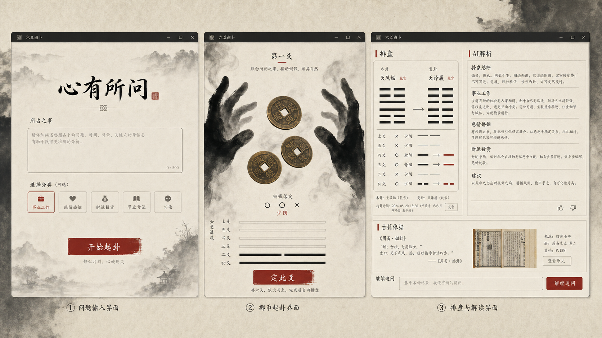

<div align="center">
  
  <h1>问爻 · WenYao</h1>
  <p><strong>把六爻排盘、规则事实、古籍证据与 AI 解读放进同一条可复核链路。</strong></p>
  <p>一款 Windows 优先的水墨六爻桌面应用。</p>

  <p>
    
    
    
    
    
    
  </p>
</div>



## 问爻是什么

很多“AI 算卦”产品把排盘、术语和结论混在一段不可验证的文字里：模型说得很像，但你无法确认卦有没有排对、用神为什么这样取、哪条判断来自程序事实、哪条只是解释。

问爻选择另一条路：**先用确定性程序完成排盘与事实计算，再让 AI 在事实和古籍证据的边界内组织解读。** 每个案例都保留起卦输入、规则版本、事实集合与证据引用，能够复算、追踪和审阅。

它不是一个套着古风皮肤的聊天框，而是一套从“起卦”到“解释”的完整工作台。

## 核心体验

- **水墨手影摇卦**：连续骨骼手势配合 Three.js 乾隆通宝，六次投掷依次形成初爻至上爻。
- **完整本卦与变卦**：六爻逐行对齐展示六神、伏神、六亲、纳甲、五行、世应、动静及变爻信息。
- **四柱不是一行小字**：年、月、日、时分别展示天干地支、五行、所属旬与旬空。
- **五行颜色有语义**：木、火、土、金、水使用稳定的属性颜色，同时保留文字标签，避免只靠颜色传达信息。
- **专业取用**：事项标签不会冒充用神。“学业功名”会继续区分学习文书、考试名次等问意，再落到父母、官鬼或具体世应关系。
- **关系事实可展开**：生、克、比和、冲、合、刑、害、破、月破、旬空、动变、进退、反吟、伏吟等以程序事实展示。
- **十二长生与受限神煞**：完整展示长生十二阶段；天乙、禄神、驿马、天喜仅作辅助，不越过用神旺衰单独定吉凶。
- **古籍证据链**：内置结构化古籍条目，支持关键词与向量混合召回、RRF 融合及可选重排。
- **本地优先**：案例、历史记录与索引保存在本机；API 密钥在 Windows 下使用 DPAPI 加密。

## 为什么这样解卦

问爻把一次解卦拆成三个明确层级：

| 层级 | 负责什么 | 不能做什么 |
| --- | --- | --- |
| 结构真值 | 铜钱值、阴阳动静、卦名、纳甲、世应、旬空等 | 不输出自由发挥的吉凶话术 |
| 规则事实 | 日月动变、生克冲合、十二长生、用神候选等 | 不把有争议的流派规则伪装成唯一真理 |
| 解释与建议 | 结合问意、事实和古籍证据生成可读判断 | 不允许编造当前卦中不存在的干支、爻位或证据 |

这样设计有三个直接好处：

1. **排盘错误不会被文采掩盖**：结构层可独立测试与复算。
2. **不同流派可以明确分开**：条件规则携带 profile 与 rule ID，不在同一套结果里偷偷混用。
3. **AI 只负责它擅长的部分**：组织语言、比较证据、解释影响，而不是凭记忆重算六十四卦。

完整说明见：[《问爻的解卦原理与流程》](./docs/解卦原理与流程.md)。

## 从占问到结论

```text
明确占问与角色
      ↓
六次投币（6 / 7 / 8 / 9）
      ↓
本卦、动爻、变卦与文王纳甲
      ↓
四柱、节令、旬空、六神、世应
      ↓
用神候选与必要澄清
      ↓
日月动变、旺衰、生克冲合、长生、神煞
      ↓
古籍证据混合检索与重排
      ↓
事实约束下的 AI 解读与可追踪引用
```

### 用神为什么不是“学业功名”

“学业功名”是问题类别，不是六亲。实际取用要继续判断占问目标：

- 问课程、论文、证书、文书：通常优先看**父母**；
- 问考试名次、录取、职位功名：通常优先看**官鬼**，并兼看父母；
- 问自身状态或双方互动：可能需要看**世爻**或**世应关系**；
- 同层出现多个候选时：保留歧义或请求澄清，不用无出处的分数强行选一个。

问爻最终选择的是“某一条具体官鬼爻 / 父母爻 / 伏神 / 世应组合”，并记录取用理由，而不是把用户输入的类别原样塞进“用神”栏。

## 快速开始

要求：Node.js 24+、npm 11+、Windows 10/11。

```powershell
git clone https://github.com/ROTl24/wenyao.git
cd wenyao
npm ci
npm run dev
```

常用命令：

```powershell
npm run typecheck       # TypeScript 全量检查
npm run test:unit       # 单元与组件测试
npm run test:electron   # Electron 服务与脚本测试
npm run build:renderer  # 构建前端与领域层
npm run build           # 构建 Windows NSIS 安装包
```

> 仓库不包含任何 API 密钥。没有配置云模型时，排盘、历史记录和确定性事实仍可使用；AI 解读会明确降级，不会伪装成已连接。

## 古籍与检索

当前本地知识库由《易隐》《卜筮正宗》《易冒》《火珠林》《增删卜易》五种文本构建：

- 1,263 条可定位原文证据；
- 495 条规则、190 条占例、578 条义理；
- 每条证据保留书名、章节和原始行号；
- `corpus-manifest.json` 记录来源文件摘要、编码、行数与条目数；
- 检索支持关键词召回、本地向量召回、RRF 融合与可选 `qwen3-rerank` 精排。

原始书籍文本属于用户本地资料，不随仓库发布。构建脚本与产物契约可用于重建和审计。

## 模型配置

默认适配阿里云百炼兼容接口：

- 解卦模型：`qwen3.7-plus`
- 向量模型：`text-embedding-v4`
- 重排模型：`qwen3-rerank`

`qwen3-rerank` 需要填写业务空间专属的完整 `/compatible-api/v1/reranks` 地址。未配置时，界面会明确显示“混合召回 + 融合排序”，不会声称已经执行模型重排。

## 技术架构

```text
React 19 + TypeScript 7 + Vite 8
               │
        Electron 43 IPC 边界
        ┌──────┴────────┐
确定性六爻领域引擎     本地案例 / 设置 / 证据库
        │                       │
规则包、事实图、用神选择   SQLite + DPAPI + 混合检索
        └──────────┬────────────┘
             受约束的 AI 解读
```

动画层使用 React Three Fiber、Three.js、GSAP 和后处理管线；领域层与渲染层分离，避免视觉状态反向影响排盘真值。

## 质量门槛

当前测试覆盖 42 个测试文件、738 条测试，包括：

- 4,096 种六次投币组合；
- 六十四卦、六十甲子旬空与 64 × 6 纳甲黄金表；
- 本卦 / 变卦六亲、伏神、世应与动爻关系；
- 十二长生、受限神煞、用神澄清与元忌仇；
- 事实 ID、规则 ID、证据 ID 的引用校验；
- 历史案例迁移、Electron 服务及结果页组件回归。

GitHub Actions 会在 Windows 环境执行类型检查、完整测试与渲染构建。

## 项目结构

```text
src/domain/liuyao/   六爻结构、规则包、事实图与用神选择
src/components/      起卦、摇卦、结果、证据与对话界面
electron/services/   本地存储、模型、检索与安全边界
resources/           已构建的规则与知识索引产物
scripts/             语料构建、校验、评测与发布脚本
docs/domain/         规则来源、差异与双重审阅记录
docs/quality/        动画关键帧和视觉验收材料
```

## 路线图

- [x] 水墨手影与三枚乾隆通宝连续摇卦
- [x] 文王纳甲、本变卦、四柱旬空、十二长生与关系事实
- [x] 具体用神候选、澄清流程与元神 / 忌神 / 仇神
- [x] 古籍证据混合检索与事实约束解读
- [ ] 可安装的公开 Release 与自动更新
- [ ] 更多经过独立复核的规则 profile
- [ ] 案例导出、打印与隐私脱敏分享

## 参与项目

欢迎提交缺陷、规则差异、原文校勘、测试样例和交互建议。涉及术数规则时，请尽量附上书名、版本、章节或页码；涉及代码时，请先确保类型检查和测试通过。

项目仍处于早期阶段。公开仓库暂未附加开源许可证，除非后续明确授权，否则保留全部权利。

## 使用边界

问爻用于传统文化研究、规则工程实验与个人反思，不构成医疗、法律、投资或其他专业建议。任何重要决定都应结合现实信息与合格专业人士意见。

<div align="center">
  <sub>问有边界，爻有出处，断有证据。</sub>
</div>
