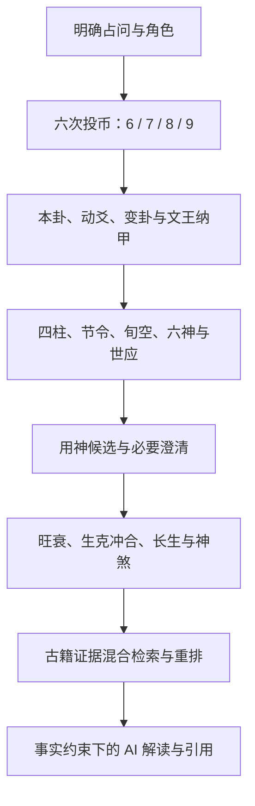

# ☯️ 问爻 · WenYao

> 把六爻排盘、规则事实、古籍证据与 AI 解读，放进同一条可追溯、可复核的链路。

[](https://github.com/ROTl24/wenyao)
[](https://github.com/ROTl24/wenyao/releases)
[](https://github.com/ROTl24/wenyao/actions/workflows/ci.yml)
[](https://github.com/ROTl24/wenyao/releases)
[](https://www.electronjs.org/)
[](https://github.com/ROTl24/wenyao/actions/workflows/ci.yml)


**[下载 Windows x64 预览版](https://github.com/ROTl24/wenyao/releases/download/v0.1.0-preview.1/WenYao-0.1.0-preview.1-Setup.exe)**
· [查看 Releases](https://github.com/ROTl24/wenyao/releases)
· [提交问题](https://github.com/ROTl24/wenyao/issues)

## 📋 项目概述

问爻是一款 Windows 优先的水墨六爻桌面应用。用户明确占问后，通过六轮三枚乾隆通宝完成起卦；程序按文王纳甲体系生成本卦、动爻、变卦、四柱、旬空、六神、世应与关系事实，再结合本地古籍证据生成可追踪的解读。

项目的核心原则是：**程序负责排盘与规则事实，AI 负责在事实和证据边界内组织语言。** 每个案例都保留起卦输入、规则版本、事实集合和证据引用，便于复算、追踪与审阅。

> 问爻不是给聊天框套一层古风界面，而是把“起卦—排盘—取用—检索—解读”做成一条边界清晰的完整链路。

## ✨ 核心能力

- **水墨沉浸式摇卦**：连续骨骼手势配合 Three.js 乾隆通宝，六次投掷依次形成初爻至上爻。
- **完整本卦与变卦**：逐爻展示六神、伏神、六亲、纳甲、五行、世应、动静和变爻信息。
- **四柱与旬空展开呈现**：年、月、日、时分别展示天干地支、五行、所属旬与旬空。
- **专业取用与必要澄清**：问题类别不会直接冒充用神；系统会继续识别具体问意，再落到父母、官鬼、妻财、子孙、兄弟或世应关系。
- **规则事实可展开**：生、克、比和、冲、合、刑、害、破、月破、旬空、动变、进退、反吟、伏吟等均以程序事实呈现。
- **十二长生与受限神煞**：完整展示十二长生；天乙、禄神、驿马、天喜只作辅助，不越过用神旺衰独立定吉凶。
- **古籍证据链**：内置结构化古籍条目，支持关键词召回、本地向量召回、RRF 融合与可选模型重排。
- **本地优先**：案例、设置和向量索引保存在本机；API 密钥在 Windows 下通过 DPAPI 加密。
- **可审计的 AI 解读**：模型只接收当前问题、只读排盘和少量候选证据，不负责重新计算排盘真值。

## 🚀 快速开始

### Windows 安装（推荐）

普通用户不需要安装 Node.js、npm，也不需要下载源码。

1. 下载 [WenYao-0.1.0-preview.1-Setup.exe](https://github.com/ROTl24/wenyao/releases/download/v0.1.0-preview.1/WenYao-0.1.0-preview.1-Setup.exe)。
2. 双击安装包，按向导选择安装目录。
3. 安装完成后，从桌面或开始菜单启动“问爻”。

| 项目 | 当前信息 |
| --- | --- |
| 版本 | `v0.1.0-preview.1` |
| 系统 | Windows 10/11 x64 |
| 安装包 | 约 145 MB |
| 签名状态 | 预览版暂未进行 Windows 代码签名 |

SHA-256：

```text
59938799F3A940002E8F2F1E07B4898A767832798B4F243834397819A4C5404B
```

下载后可在 PowerShell 中校验：

```powershell
Get-FileHash .\WenYao-0.1.0-preview.1-Setup.exe -Algorithm SHA256
```

> SmartScreen 可能显示“Windows 已保护你的电脑”。请只从本项目 Releases 下载，
> 确认 SHA-256 一致后再选择“更多信息”→“仍要运行”。安装版功能以对应
> Release 说明为准，`main` 分支可能包含尚未发布的后续改动。

### 从源码运行

环境要求：Node.js 24+、npm 11+、Windows 10/11。

```powershell
git clone https://github.com/ROTl24/wenyao.git
cd wenyao
npm.cmd ci
npm.cmd run dev
```

常用命令：

| 命令 | 用途 |
| --- | --- |
| `npm.cmd run typecheck` | TypeScript 全量检查 |
| `npm.cmd test` | 运行渲染层、领域层与 Electron 完整测试 |
| `npm.cmd run build:renderer` | 构建渲染层与领域层 |
| `npm.cmd run build` | 构建 Windows NSIS 安装包 |

> 仓库不包含任何 API 密钥。未配置云模型时，起卦、排盘、历史记录和确定性事实仍可使用；需要云端能力的解读会明确降级，不会伪装成已经连接。

## 🧭 从占问到结论



### 为什么“学业功名”不是用神

“学业功名”是问题类别，不是六亲。实际取用还要继续判断占问目标：

- 问课程、论文、证书、文书：通常优先看**父母**；
- 问考试名次、录取、职位功名：通常优先看**官鬼**，并兼看父母；
- 问自身状态或双方互动：可能需要看**世爻**或**世应关系**；
- 同层出现多个候选时：保留歧义或请求澄清，不用无出处的分数强行选择。

问爻最终选择的是某一条具体官鬼爻、父母爻、伏神或世应组合，并记录取用理由，而不是把用户输入的类别原样填进“用神”栏。

## 🧠 三层责任边界

| 层级 | 负责什么 | 明确不做什么 |
| --- | --- | --- |
| 结构真值 | 铜钱值、阴阳动静、卦名、纳甲、世应、旬空等 | 不输出自由发挥的吉凶话术 |
| 规则事实 | 日月动变、生克冲合、十二长生、用神候选等 | 不把有争议的流派规则伪装成唯一真理 |
| 解释与建议 | 结合问意、事实和古籍证据生成可读判断 | 不编造当前卦中不存在的干支、爻位、规则或证据 |

这样的分层让结构层可以独立测试和复算，让不同规则 profile 保持清晰，也让 AI 只承担语言组织、证据比较和影响解释。

完整说明见 [《问爻的解卦原理与流程》](./docs/解卦原理与流程.md)。

## 📚 古籍与检索

当前本地知识库由《易隐》《卜筮正宗》《易冒》《火珠林》《增删卜易》五种文本构建。

| 内容 | 数量 |
| --- | ---: |
| 可定位原文证据 | 1,263 条 |
| 规则 | 495 条 |
| 占例 | 190 条 |
| 义理 | 578 条 |

- 每条证据保留书名、章节和原始行号；
- `corpus-manifest.json` 记录来源文件摘要、编码、行数与条目数；
- 检索支持关键词召回、本地向量召回、RRF 融合，以及可选的 `qwen3-rerank` 精排；
- 原始书籍文本属于用户本地资料，不随仓库发布；构建脚本与产物契约用于重建和审计。

## 🤖 模型配置与隐私边界

默认适配阿里云百炼兼容接口：

| 能力 | 默认模型 |
| --- | --- |
| 解卦 | `qwen3.7-plus` |
| 向量 | `text-embedding-v4` |
| 重排 | `qwen3-rerank` |

`qwen3-rerank` 需要填写业务空间专属的完整 `/compatible-api/v1/reranks`
地址。未配置时，界面会明确显示“混合召回 + 融合排序”，不会声称已执行模型重排。

隐私与降级策略：

- API 密钥通过 Electron `safeStorage` 保存，在 Windows 上由 DPAPI 加密；
- 历史案例、设置和向量索引留在本机；
- 日常解卦只向模型发送当前问题、只读排盘和命中的少量证据；
- 云端模型不可用时，确定性排盘和事实链路仍然可用。

## 🏗️ 技术架构

### 核心技术栈

- **桌面容器**：Electron 43 + 严格 IPC 边界
- **渲染层**：React 19 + TypeScript 7 + Vite 8
- **动画层**：React Three Fiber + Three.js + GSAP
- **领域层**：确定性六爻规则、事实图、用神选择和报告契约
- **本地存储**：原子化 JSON 案例存储 + 本地向量索引
- **安全能力**：Electron `safeStorage` + Windows DPAPI
- **云端模型**：阿里云百炼兼容接口

```text
React 19 + TypeScript 7 + Vite 8
               │
        Electron 43 IPC 边界
        ┌──────┴────────────────┐
确定性六爻领域引擎         本地案例 / 设置 / 证据库
        │                          │
规则包、事实图、用神选择   JSON 存储 + DPAPI + 混合检索
        └────────────┬─────────────┘
              受约束的 AI 解读
```

领域层与渲染层相互分离，视觉状态不会反向影响排盘真值；模型输出也必须通过结构化契约和证据引用校验后才能进入结果链路。

## ✅ 质量保障

当前完整测试共 **55 个测试文件、827 条测试**：

- 42 个 Vitest 测试文件，738 条单元、组件与领域测试；
- 13 个 Electron / Node 测试文件，89 条服务、存储、检索与安全边界测试；
- 覆盖 4,096 种六次投币组合、六十四卦、六十甲子旬空与 `64 × 6` 纳甲黄金表；
- 覆盖本卦 / 变卦六亲、伏神、世应、动爻关系、十二长生、受限神煞与用神澄清；
- 覆盖事实 ID、规则 ID、证据 ID 引用校验、历史迁移、IPC 边界与结果页回归。

GitHub Actions 会在 Windows 环境执行：

1. TypeScript 类型检查；
2. 完整测试；
3. 渲染层构建。

## 📖 文档导航

| 文档 | 内容 |
| --- | --- |
| [解卦原理与流程](./docs/解卦原理与流程.md) | 从结构真值、规则事实到证据约束解读的完整链路 |
| [文王纳甲审阅](./docs/domain/wenwang-najia-v2-review.md) | 纳甲结构、来源与双重审阅记录 |
| [用神规则审阅](./docs/domain/use-god-core-v1-review.md) | 用神候选、澄清与元神 / 忌神 / 仇神规则 |
| [关系事实审阅](./docs/domain/relation-core-v1-review.md) | 生克冲合、刑害破等关系事实 |
| [十二长生与神煞审阅](./docs/domain/growth-shensha-core-v1-review.md) | 十二长生与受限神煞规则 |
| [最终验收记录](./docs/acceptance/2026-07-11-final-acceptance.md) | 功能、质量与发布验收材料 |

## 🗂️ 项目结构

```text
src/domain/liuyao/   六爻结构、规则包、事实图与用神选择
src/components/      起卦、摇卦、结果、证据与对话界面
src/features/ritual/ 水墨手影、古币模型、轨迹与仪式状态机
electron/services/   本地存储、模型、检索与安全边界
resources/           已构建的规则与知识索引产物
scripts/             语料构建、校验、评测与发布脚本
docs/domain/         规则来源、差异与双重审阅记录
docs/quality/        动画关键帧与视觉验收材料
```

## ❓ 常见问题

### 不配置 API 密钥可以使用吗？

可以。起卦、排盘、历史记录和确定性事实不依赖云模型；需要云端能力的解读与向量构建会明确提示不可用或降级。

### 为什么安装时会出现 SmartScreen 提示？

当前预览版尚未进行 Windows 代码签名。请只从本项目 Releases 下载，并在安装前核对 SHA-256。

### macOS 或 Linux 可以直接安装吗？

当前公开安装包仅支持 Windows 10/11 x64，仓库也只在 Windows CI 中验证。其他平台暂未提供正式安装包。

### 数据会全部上传到云端吗？

不会。历史案例、设置和向量索引保存在本机；调用云模型时，只发送完成当前解读所需的问题、只读排盘和少量候选证据。

### 问爻的结论可以替代专业意见吗？

不可以。问爻用于传统文化研究、规则工程实验与个人反思，不构成医疗、法律、投资或其他专业建议。

## 🗺️ 路线图

- [x] 水墨手影与三枚乾隆通宝连续摇卦
- [x] 文王纳甲、本变卦、四柱旬空、十二长生与关系事实
- [x] 具体用神候选、澄清流程与元神 / 忌神 / 仇神
- [x] 古籍证据混合检索与事实约束解读
- [x] Windows x64 NSIS 公开预览安装包
- [ ] Windows 代码签名与自动更新
- [ ] 更多经过独立复核的规则 profile
- [ ] 案例导出、打印与隐私脱敏分享

## 🤝 参与项目

欢迎提交缺陷、规则差异、原文校勘、测试样例和交互建议。

1. Fork 本仓库。
2. 创建功能分支：`git checkout -b feature/your-feature`。
3. 完成修改并运行 `npm.cmd run typecheck` 与 `npm.cmd test`。
4. 提交并推送分支。
5. 创建 Pull Request，说明问题、方案与验证结果。

涉及术数规则时，请尽量附上书名、版本、章节或页码；提交代码时，请勿包含真实 API Key、Token、个人案例或其他敏感数据。

## ⚖️ 使用边界与许可说明

- 本项目用于传统文化研究、规则工程实验与个人反思；
- 不构成医疗、法律、投资或其他专业建议，重要决定请结合现实信息与合格专业人士意见；
- 仓库当前暂未附加开源许可证。公开可见不等于获得复制、修改或分发授权；除非后续明确授权，否则保留全部权利。

---

_问有边界，爻有出处，断有证据。_
